  

 

**[VST-Underbloom](https://github.com/Rootforge/VST-Underbloom)** — creative sample instrument: load any audio or video, reshape through 5 synthesis engines · C++/JUCE · VST3  
**[VST Tape IY Beats](https://github.com/Rootforge/VST_Tape_IY_Beats)** — analog tape multi-effect: wow/flutter, saturation, tape echo · C++/JUCE · VST3  
**[Netology-VKinder](https://github.com/Rootforge/Netology-VKinder)** — VK API matchmaking bot · Python  

*more projects not yet on GitHub — game, tools, automation, real estate bot*

---

строю инструменты · пишу код · делаю музыку &nbsp;|&nbsp; 🌐 <a href="https://www.psyrain.ru">psyrain.ru</a> &nbsp;·&nbsp; 📍 Siberia
